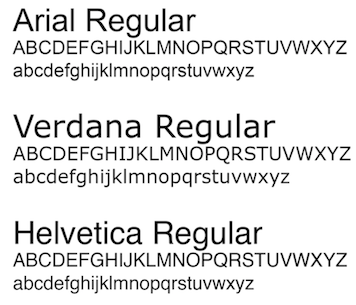

<!-- .slide: data-background="../images/title-slide.jpg" -->
<!-- .slide: id="a11y" -->
## Including Accessibility in Projects

---
<!-- .slide: id="a11y-what-is-accessibility" -->
## What is Accessibility

- Accessibility is generally defined as giving people of all abilities opportunities to participate fully in everyday life.  This more recently includes use of digital technology.

- Accessibility can often be thought of as being complimentary to, or a subset of usability.  A feature on a site may be highly usable but inaccessible.  

  - For example, a button may be easy to find and click, but inaccessible via a keyboard

- Accessibilty is now law in many parts of the world including within Canada and the U.S.

- Accessiblity requirements for digital content / media are based on the international standards defined by the W3C.  
    - In 1999, the Web Content Accessibility Guidelines (WCAG) 1.0 were developed, updated to v2.0 in 2008
    - There are three levels of compliance that an organization can meet in  WCAG 2.0:  A, AA and AAA
    - Most compliance internationally, including within government, is against v2.0 AA

---
<!-- .slide: id="a11y-POUR" -->
## P.O.U.R.

The key principles of accessibility specify that sites must be:

1. Perceivable - Content on a site must be perceivable with assistive devices to aid those who have difficulties using one or multiple senses

1. Operable - A site must provide several ways to operate it to be accessible.  Eg. use of a mouse AND a keyboard to navigate and operate all site controls

1. Understandable - A site must use simple terms to explain concepts and complex issues / content  
  - It must function in a way that your users understand, by avoiding unusual, unexpected or inconsistent functions

1. Robust - A site must meet several accessiblity standards and guidelines on any number of 3rd party user software and tools (i.e multiple browsers, operating systems, mobile devices)

---
<!-- .slide: id="a11y-starting-with-design" -->
## Implementing Accessibility - Starting with Design

Accessibility starts with design and includes accessibility testing throughout the product development life cycle.

Some of the Largest Identified Accessibility Barriers across Public Sites

1. Content and functionality that cannot be operated through a keyboard
1. Form fields that are not labelled properly
1. Images that don’t have alternative text
1. Insufficient contrast between text and background
1. Reading order that is not in a meaningful sequence

Designers and developers can include several accessibility and design features **in combination with each other** to overcome challenges:

---
<!-- .slide: id="a11y-tabbing-order" -->
## Accessible Design - Tabbing Order

- When developing sites accessibily, ensure that read / tabbing order is left to right, top to bottom so that sites 'read like a book'
<br>
<br>GIF showing accessible tabbing order of a page
<br>

---
<!-- .slide: id="a11y-font-colour-images" -->
## Accessible Design - Font, Colour and Images

- Fonts: Use sans serif fonts and set a base pixel measure at 1em = 16px (=12pt)
  - Use a site like <pxtoem.com> to convert `pt` measurement to `px` and/or `em` measurement for relative font sizing
  - Alter the base depending on the device type: Desktop = 1.0em, Tablet = 1.1em, Smartphone=1.2em
- Colour:  Ensure foreground:background ratios are 4:5:1 for normal text and 3:1 for large text
- Images: Images must be alt tagged or have figures/numbers describing the image
<br> 
<br>Two images showing samples of a accessible font types and fore/back ground colour ratios
<br>

---
<!-- .slide: id="a11y-measuring-colour-contrast" -->
## Accessible Design - Measuring Colour Contrast

- Foreground text / image colour must sufficiently contrast background text/image colour to allow items to be visually readable

- To be accessible, a specific contrast ratio of fore to background must be met

- Large text is consider 18 pt or larger if not bold; 14pt or larger if bold
  - Requires a 3:1 colour contrast. 

- Normal text falls under the above text sizes for non-bold and bold text respectively
  - Requires a 4:5:1 colour contrast

- Use a site like [the webaim contrast checker](http://webaim.org/resources/contrastchecker/) or [colorable](https://colorable.jxnblk.com/) to check foreground to background contrast
    - Any colour contrast checker like the webaim site will work to do this check

---
<!-- .slide: id="a11y-tables" -->
## Accessible Design - Tables
- Tables:  Do not use tables for layout, only data, and explicitly label columns and rows
<br><br> 
<br>Example of an inaccessible table, cells span multiple rows and columns
<br><br>
<br>Example of an accessible table, all rows/columns explicitly labelled
<br>

---
<!-- .slide: id="a11y-links-and-buttons" -->
## Accessible Design - Links and Buttons
- Links and Buttons: Must be descriptive (e.g. 'complete order' instead of 'click here')
- Don't put URL's onto a page, instead hyperlink text describing what link is for
  - Example from the previous page - the link to [colorable](https://colorable.jxnblk.com/)
- Must indicate the action of the link or button as part of the link or alt/title text (e.g. 'this will open in a new window') 

<br>
<br>Example of an accessible link and button
<br>

---
<!-- .slide: id="a11y-modals" -->
## Accessible Design - Modals and Pop-Up Windows
- Modals should be developed for information purposes and not have complex interactive elements.
- Pages with lengthy content should have clear markers indicating the scope of the content and provide the ability to jump to key points including the beginning and end

<br>
<br>Example of an accessible modal window with link to top of page
<br>

---
<!-- .slide: id="a11y-setup" -->
## Accessible Development - Set Up

- In preparation for this section, please serve the todo app locally using the live-server command
- Running ng serve does not work with voiceover
  - npm install -g live-server
  - npm run build
  - live-server dist

---
<!-- .slide: id="a11y-considerations" -->
## Accessible Development - General Considerations

- Attempt to pin down client requirements for browsers to be supported before you start
  - Screen readers may behave differently with different browsers, which may require time to address
- Design and test accessibility includng unit testing from the start of a project instead of making it an add on later
- Familiarize yourself with JAWS and how other screen readers work.  Conduct a demo if required with your team
- Use syntactical scanning software (such as HiSoftware Compliance Sherriff) to help check for accessibility, but don't solely depend on them
- Use native HTML elements instead of developing custom controls
- Ensure HTML and CSS generated by Angular code enforces the following rules for accessibility


---
<!-- .slide: id="a11y-dev-tabbing-order" -->
## Accessible Development - Tabbing Order

- Ensure content is read top to bottom and left to right.  
- Use native elements, ARIA, and `tabindex` to set the screen read order 
- To put focus on elements in a certain order for a screen reader, the `tabindex` attribute can be set
- `tabindex` can be set to negative integers, 0, or positive integers and even make the screen reader read out of visual order
    - For example, if `tabindex` is set to 2, 1, 3, then visually, elements may read 1, 2, 3, but a screen reader will pick up 2, 1, 3
<br>
<br>Example of `tabindex` and tabbing order
<br>

---
<!-- .slide: id="a11y-tabbing-negative" -->
## Accessible Development - Tabbing Order - Negative 

- Use `tabindex="-1"` to put focus on elements that need to be read by screen readers that are to remain hidden visually initially

For example - we add this HTML to the top of a page to dynamically show error messages
```
<div role="group" id="errorSummary" aria-labelledby="errorSummaryHeading" tabindex="-1">
  <h2 id="errorSummaryHeading">Your information contains three errors</h2>
    <ul>
      ...
    </ul>
</div>
```
- We want to focus the cursor at the top of the page to start the reading order correctly, but don't want to read the error yet
- Here we would use scripting to change the visibility of the error when an exception is thrown (and set `tabindex="0"` on change)

---
<!-- .slide: id="a11y-tabbing-zero" -->
## Accessible Development - Tabbing Order - Zero or Positive

- Use `tabindex=0` to include elements in the natural tab order of the content
  - It may be easier to include a native HTML element that is focusable by default rather than create a custom control

- Let the browser naturally handle tab order otherwise and do not use positive integers for `tabindex`, e.g. `tabindex="+1"` 

- Utilizing `tabindex="-1"` in conjunction with native elements to allow screen readers to follow the right read order

```
<!-- we want to focus on this list and dynamically show/read the bulleted links at a certain time -->
<ul role="menu" aria-hidden="true">								
  <li role="menuitem" tabindex="0">										
    <a href="a.com" title="go to something.com" tabindex="-1">something.com</a>
    <a href="a.com" title="go to x.com">x.com</a>											
  </li>									
  <li role="menuitem" tabindex="0">										
	  <a href="b.com" title="go to b.com" tabindex="-1">b.com</a>											
  </li>									
</ul>
```

---
<!-- .slide: id="a11y-page-sections" -->
## Accessible Development - Defining Page Sections

- Functionally divide the page up so that the user knows what section they are in with a screen reader
- There are several techniques for acheiving this (used in combination as required)
  - Use of `tabindex` as previously outlined
  - Additionally use of HTML elements to divide the page into functional sections
  - Use hidden navigation sections to allow for easy skipping of sections by screen readers
  - Use of text positioned off screen to provide readable content indicating what each of those sections are
- These will be examined in the following slides

---
<!-- .slide: id="a11y-dividing-the-page" -->
## Accessible Development - Dividing the Page

- Define the header, footer, and main sections of a page at a minimum
  - Header: `<header class="Header" role="banner" id="header" tabindex="0">`
  - Main: `<div id="content" class="wpthemeMainContent" role="main" tabindex="0" style="min-height: 587px;">`
  - Footer: `<footer id="footer" class="Footer" role="contentinfo" tabindex="0">`

---
<!-- .slide: id="a11y-offscreen" -->
## Accessible Development - CSS for Navigation and Offscreen Text

- Develop off-screen text and navigation related CSS classes to mark up page sections in a way hidden to visual users
- Off screen text can provide additional valuable information audibly needed by screen reader users for clarity
- Screen readers re-read everything on every re-load. "Skip to nav" allows users to bypass what they've already heard

```css
.offscreen-text {
  left: -3000px;
  position: absolute;
  width: 500px;
  font-size: 100%;}
```

```css
.SkipToNav {
  position: absolute;
  top: 0;
  right: 0;
  font-size: .6em;
  padding-right: .375em;
}
```

---
<!-- .slide: id="a11y-html-offscreen" -->
## Accessible Development - HTML for Offscreen Text and Navigation

- Add the HTML necessary to define navigation and offscreen text, marking sections for non-visual users and to allow easy skipping of sections
  - Screen readers like JAWS re-read all sections of a page upon page re-load, unless you give a user a mechanism for skipping sections

For example in your header div: 
```
	<nav class="SkipToNav" role="navigation">
		<h2 class="Offscreen-Text">Start of a.com skip to page section links</h2>
		<ul>
			<li><a href="#content">Skip to content</a></li>
			<li><a href="#footer">Skip to footer</a></li>
			<li class="Hide"><a id="skipToErrorLink" href="#errors">Skip to errors</a></li>
		</ul>
	</nav>
```
- Demo clip: Example of 'skip to nav' 

---
<!-- .slide: id="a11y-clip" -->
## Accessible Development - CSS Clip Attribute

- Rather than use an offscreen-text class, CSS offers a `clip:` attribute natively that can be used to set text to an 'invisible' state, which you can use similarly
- The advantage of using `clip:` attribute is that the text is truly not visible to non screen-reader users.  Off screen text may become visible on a large screen in a responsive site
- The basic syntax is `clip: { shape | auto | inherit } ;` and it only works with absolute or fixed position, not relative
  - shape - only the `rect()` shape exists
  - auto - sets the default behaviour at full image / text size - like not using clip at all
  - inherit - will inherit the clip from its parent

---
<!-- .slide: id="a11y-clip-example" -->
## Accessible Development - CSS Clip Attribute Example
```
<style>
.clp {
    position: absolute !important; 
    clip: rect(1px,1px,1px,1px); 
}
</style>
</head>
<body>

<h1 class="clp">This is offscreen text</h1>
</body>
```

---
<!-- .slide: id="a11y-dev-table-ex" -->
## Accessible Development - Tables

- Say we want to develop this table

<br>
<br>Example table
<br>

- Consider if it is a data table versus a layout table
- Consider use of `<div>` versus `<table>` tags

---
<!-- .slide: id="a11y-table-considerations" -->
## Accessible Development - Table Considerations

- Layout tables should be done using CSS and DIVS or table tags
  - Include ARIA roles to define table elements for screen readers if using divs
- If developing layout tables in HTML
  - Use the non-standard `datatable=0` attribute on the Table tags to tell JAWS to ignore layout tables
  - Don't use the `summary` attribute on the Table tag if you must create a layout table (or set the `summary` attribute to null)
  - Don't use `<TH>` or Caption tags on layout tables
  
- You can use `<TH>` and summary attributes for data tables and include the `scope="ROW"` or `scope="COL"` attributes to indicate what     the `<TH>` is for

---
<!-- .slide: id="a11y-div-css" -->
## Accessible Development - Example CSS Layout Table for Divs

```css
<style>
div.container {
    width: 100%;
    border: 1px solid gray;
}
div.header {
    color: white;
    background-color: black;
}
div.main {
    color: black;
    background-color: white;
}
div.footer {
    color: white;
    background-color: black;
}
</style>
```

---
<!-- .slide: id="a11y-div-html" -->
## Accessible Development - Example Layout Table Using Divs

```
<div class="container" role="table">
  <div class="header" role="rowgroup">
    <span>something</span>
  <div>
  <div class="main" role="rowgroup">
    <span><p>This is an example.</p></span>
  </div>
  <div class="footer" role="rowgroup">
    <span>Example Footer</span>
  </div>
</div>
```

---
<!-- .slide: id="a11y-css-layout" -->
## Accessible Development - Example CSS for Layout

Example CSS for a layout table using standard `HTML`
```
<style>
div.container {
    width: 100%;
    border: 1px solid gray;
}
header, footer {
    padding: 1em;
    color: white;
    background-color: black;
    clear: left;
    text-align: center;
}
main {
    color: black;
    background-color: white;
    text-align: center;
}
</style>
```

---
<!-- .slide: id="a11y-layout-html" -->
## Accessible Development - Example HTML Layout Table 

Example `HTML` for a table built with standard table notation:

```
<div class="container">
  <header>
     <h1>Example Header</h1>
  </header>
  <main>
    <p>This is some text</p>
  </main>
  <footer><h2>Example Footer</h2></footer>
</div>
```

---
<!-- .slide: id="a11y-dev-fonts" -->
## Accessible Development - Fonts, Headers and Templates
- Use relative width and font sizing over absolutes where possible
  - `width: 50%;` 
  - `font-size: 1em;`, `font-size: 80%;`

- Use headers in sequnce (H1 - H6)

- Note, if you are using Bootstrap templates, you are going to have to implement accessibility in detail as these templates don't have out of the box support for it
- Tachyons.io docs/templates have varying degrees of support.  Again, ensure you implement and test all accessibility considerations thoroughly.

---
<!-- .slide: id="a11y-dev-link-button" -->
## Accessible Development - Links and Buttons

- Add `title` attributes to links and `alt` text to images to provide accessible descriptions to them
- Use native HTML elements where possible instead of creating custom controls with ARIA roles attached.  For example:

```
<section class="Navigation"> 
  <div class="Buttons">
    <div class="Submit">
      <button class="buttonnav" type="submit" id="orderNowBtn" title="Click to order this product now">Order now</button>
    </div>
    <div class="Cancel">
      <a href="/lastpage" title="Select back to go to the previous page">Back</a>
    </div>
  </div>
</section>
```


---
<!-- .slide: id="a11y-testing" -->
## Testing Accessibility - Approach

- Accessibility testing should typically start with manual testing and syntactical scanning, then be automated
- Manually: Test against a checklist of items as compared to WCAG 2.0 AA standards to ensure compliance
- Syntactically: Use Accessibility Developer Tools on [Chrome](https://developer.chrome.com/devtools) and [Firefox](https://addons.mozilla.org/en-US/firefox/addon/accessibility-evaluation-toolb/), [HiSoftware Compliance Sheriff](https://www.cryptzone.com/products/compliance-sheriff), [Webaim Wave](www.wave.webaim.org/)
- Most importantly, end to end test using screen readers (Windows) and voiceover (Mac)
- Then can automate tests with tools like Axecore
- Remember to include a wide range of tests to handle a variety of accessible needs
  - Users have a degree of needs, for example for vision, from colour blindness to full blindness
    - Use tools like this [colorblindness filter](https://www.toptal.com/designers/colorfilter) to test your site
  - Use a tool like [Microsoft's Inclusive Design toolkit](https://www.microsoft.com/en-us/design/inclusive) to help develop your AC for accessible testing

---
<!-- .slide: id="a11y-test-ex1" -->
## Testing Accessibility - Example #1

Upon inspection,the following inaccessible header line at the top of a form would have to be modified from:

```HTML
<h1>To Do</h1>
```

To:

```HTML
<header>
    <h1 class="offscreen-text">Start of header section of form</h1>
    <h1 tabindex="0">To Do</h1>
</header>
```

A `<main>` and `<footer>` section could then be added to the rest of the form as required

---
<!-- .slide: id="a11y-test-ex2" -->
## Testing Accessibility - Example #2

Upon inspection, the following inaccessible form input would have to be modified from:

```HTML
<p>
    New Item: <input name="newItem" required>
    <button type="submit" disabled>Add</button>
</p>
```

To:

```HTML
<p class="text">
    New Item: <input name="newItem" title="input a new item in alphanumeric format" required>
    <button type="submit" class="button" title="Select this button to add a new item to the list">Add</button>
</p>
```

---
<!-- .slide: id="a11y-test-ex3" -->
## Testing Accessibility - Example #3

Upon inspection, the following inaccessible error message section would have to be modified from:

```HTML
<ul class="errors">
    <li>
      New item text is required
    </li>
</ul>
```

To:

```HTML
<div class="error"; tabindex="-1" aria-hidden="true" class="error">
    <span>Error:  Please enter item detail in alphanumeric format item</span>
</div>
```