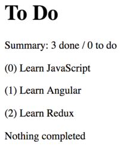
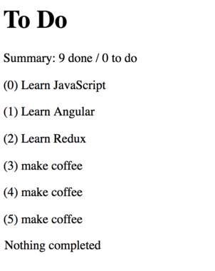

<!-- .slide: data-background="../images/title-slide.jpg" -->
<!-- .slide: id="display" -->
## Building Applications with Angular

# Displaying Data

---
<!-- .slide: id="display-roadmap" -->

## Roadmap

1. Where do I put static data in a component?
1. How do I display multiple values?
1. How do I make items findable?
1. How do I control what is displayed?
1. When does Angular update its display of data?

---
<!-- .slide: id="display-make-the-data" -->
## Make the Data

- Change the title
- Add a list of strings

#### _src/app/app.component.ts_
```ts
@Component({
  // ...as before...
})
export class AppComponent {
  title = 'To Do';
  thingsToDo = [
    'Learn JavaScript',
    'Learn Angular',
    'Learn Redux'
  ];
}
```

---
<!-- .slide: id="display-display-the-data" -->
## Display the Data

- Use `*ngFor` to repeat some HTML multiple times
- The loop variable `item` is created locally

#### _src/app/app.component.html_
```html
<h1>{{title}}</h1>
<p *ngFor="let item of thingsToDo">{{item}}</p>
```


---
<!-- .slide: id="display-ngfor-exports" -->
## `*ngFor` Exports Useful Values

- We can obtain the 0-based index of each iteration and assign the value to a local variable:

#### _src/app/app.component.html_
```html
<h1>{{title}}</h1>
<p *ngFor="let item of thingsToDo; let i = index">({{i}}) {{item}}</p>
```

- Similarly, `*ngFor` exports `first`, `last`, `even` and `odd` Booleans which can also be assigned to local variables.

---
<!-- .slide: id="display-ngif-1" -->
## Nothing to See Here, Folks

- Use `*ngIf` to control whether or not something is displayed
  - More precisely, whether or not something is added to the DOM
  - See how to show and hide content with styles later

#### _src/app/app.component.ts_
```ts
export class AppComponent {
  // ...as before...
  thingsCompleted = [];
}
```

---
<!-- .slide: id="display-ngif-2" -->
## Nothing to See Here, Folks

#### _src/app/app.component.html_
```html
<h1>{{title}}</h1>
<p *ngFor="let item of thingsToDo; let i = index" id="{{i}}">({{i}}) {{item}}</p>
<p *ngIf="thingsCompleted.length == 0">Nothing completed</p>
```


---
<!-- .slide: id="display-dynamic-content-1" -->
## Dynamic Content

- Interpolated expressions can include function and method calls

#### _app/component/app.component.ts_
```ts
export class AppComponent {
  // ...as before...
  summary(): string {
    return `${this.thingsToDo.length} done / ${this.thingsCompleted.length} to do`;
  }
}
```

#### _app/component/app.component.html_
```html
<h1>{{title}}</h1>
<p>Summary: {{summary()}}</p>
<p *ngFor="let item of thingsToDo; let i = index" id="{{i}}">({{i}}) {{item}}</p>
<p *ngIf="thingsCompleted.length == 0">Nothing completed</p>
```

---
<!-- .slide: id="display-dynamic-content-2" -->
## Dynamic Content



---
<!-- .slide: id="display-dynamic-content-3" -->
## Dynamic Content

- Angular notices data changes and updates page according
- Show this by adding a to-do item to the list every second

#### _app.component/app.component.ts_
```
export class AppComponent {
  // ...as before...
  constructor() {
    setInterval(() => {
      this.thingsToDo.push('make coffee');
    }, 1000);
  }
}
```

---
<!-- .slide: id="display-dynamic-content-4" -->
## Dynamic Content

- Both the list and the summary update every second


