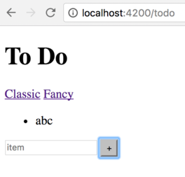

<!-- .slide: data-background="../images/title-slide.jpg" -->
<!-- .slide: id="routing" -->
## Building Applications with Angular

# Routing

---
<!-- .slide: id="routing-roadmap" -->
## Roadmap

1. How do I route different URLs to different parts of an application?
1. How do I change what is displayed based on the URL?

---
<!-- .slide: id="routing-why-routing" -->
## Why Routing?

- Routing allows users to navigate to different parts of the application
  while maintaining application state
- Angular encourages creation of modular applications (every module define its own routes)
- Note: routing is optional
  - Can build applications that never change URL
  - But that makes locations within the application un-bookmarkable

---
<!-- .slide: id="routing-fancy-lists" -->
## Fancy Lists

- Create a `FancyListComponent` that displays the same to-do list in a different way
- Allow users to switch between them by going to `/todo` and `/fancy`

#### _src/app/fancy-list/fancy-list.component.html_
```html
<table>
  <tr *ngFor="let item of thingsToDo; let i = index" id="{{i}}">
    <td>{{i}}</td>
    <td class="item">{{item}}</td>
  </tr>
</table>
```

#### _src/app/fancy-list/fancy-list.component.css_
```css
td.item {
    color: #E0E0E0;
    background-color: #202020;
}
```

---
<!-- .slide: id="routing-configuring-routing" -->
## Configuring Routing

- Set `base` tag in the `<head>` of `src/index.html` to tell Angular where routes start

#### _src/index.html_
```html
 <base href="/">
```

- Allows applications to be hosted below the root of the domain
  - E.g., `http://rangle.io/some/path` would set `base` to `/some/path`

---
<!-- .slide: id="routing-defining-routes" -->
## Defining Routes

- Create array of type `Routes` that specifies what to do with different paths
- A plain TypeScript file (not created with Angular CLI)

#### _src/app/app.routes.ts_
```ts
import { Routes } from '@angular/router';
import { ToDoListComponent } from './to-do-list/to-do-list.component';
import { FancyListComponent } from './fancy-list/fancy-list.component';

export const routeConfig: Routes = [
  { path: '', redirectTo: '/todo', pathMatch: 'full' },
  { path: 'todo', component: ToDoListComponent },
  { path: 'fancy', component: FancyListComponent }
];
```

---
<!-- .slide: id="routing-common-attributes-in-routes" -->
## Common Attributes in Routes

| Attribute    | Use |
|--------------|--------------------------------------------------------------|
| `path`       | Browser URL for route                                        |
| `component`  | Component displayed for route                                |
| `redirectTo` | Where to redirect                                            |
| `pathMatch`  | Match full `path` or just the beginning?                     |
| `children`   | Array of route definitions objects representing child routes |

- `component` and `redirectTo` are mutually exclusive
- `children` will be discussed later

---
<!-- .slide: id="routing-adding-router-module" -->
## Adding Router Module

- Import `routeConfig` into `app.module.ts`
- Add `RouterModule.forRoot(routeConfig)` to `imports`
  - Creates a *configured* router module

#### _src/app/app.module.ts_
```ts
import { RouterModule, Routes } from '@angular/router';
import { routeConfig } from './app.routes';

@NgModule({
  // ...as before...
  imports: [
    // ...as before...
    RouterModule.forRoot(routeConfig)
  ],
  // ...as before...
})
export class AppModule { }
```

---
<!-- .slide: id="routing-adding-router-outlet" -->
## Adding RouterOutlet

- Use `<router-outlet></router-outlet>` to show where to display routed content
- Angular dynamically places content *after* the tag

#### _src/app/app.component.html_
```html
<h1>{{title}}</h1>
<nav>
  <a [routerLink]="['/todo']">Classic</a>
  <a [routerLink]="['/fancy']">Fancy</a>
</nav>
<router-outlet></router-outlet>
<app-generic-input (newItem)="onNewItem($event)"></app-generic-input>
```

- Use `routerLink` to create links between dynamic components
  - Parameter is an array of values


<!-- preview: https://plnkr.co/edit/3EH52DtjS1Z5fUbycMX9?p=preview -->

---
<!-- .slide: id="routing-final-appearance" -->
## Final Appearance

| Classic View | Fancy View |
|--------------|------------|
|  |  |

- But going to `http://localhost:4200/todo` clears all the to-do items!
- ...pause for thought...
- Because we're re-loading the application, which throws away the accumulated list
- We need to persist our data
