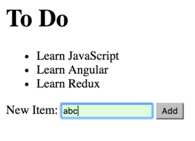

<!-- .slide: data-background="../images/title-slide.jpg" -->
<!-- .slide: id="template-forms" -->
## Building Applications with Angular

# Template Driven Forms

---
<!-- .slide: id="template-forms-roadmap" -->

## Roadmap

1. How does Angular support forms?
1. How do I create a template driven form?
1. How do I handle form data?
1. How do I validate form data?
1. How do I display error messages?

---
<!-- .slide: id="template-forms-overview" -->
## Overview

- Template Driven Forms: controls and validation rules defined in the template with directives
- Reactive Forms: controls and validation rules defined in the component class or service
  - Explore these in the next section

---
<!-- .slide: id="template-forms-creating" -->
## Creating Template Driven Forms

- Import `FormsModule` from `@angular/forms` into `app.module.ts`
- Allow us to use all the features of template-driven forms

#### _src/app/app.module.ts_
```ts
// ...existing imports...
import { FormsModule } from '@angular/forms';

@NgModule({
  // ...as before...
  imports: [
    BrowserModule,
    HttpModule,
    FormsModule        // added
  ],
  // ...as before...
})
export class AppModule { }
```

---
<!-- .slide: id="template-forms-handing-form-data-1" -->
## Handling Form Data

- Use `ngModel` and `ngForm` directives to handle form data
- `ngForm` provides properties to get information from the form like `value` and `valid`
- `ngModel` provides the same property for individual fields

#### _src/app/generic-input/generic-input.component.html_
```html
<form #newItemForm="ngForm">
  <p>New Item: <input name="newItem" ngModel></p>
</form>
```

<!-- example: https://plnkr.co/edit/sdVst5yprdQUgQctQz9p?p=preview -->

---
<!-- .slide: id="template-forms-handling-form-data-2" -->
## Handling Form Data

- Every `<form>` element is automatically enhanced by the `NgForm` directive
- `newItemForm` is a template variable that holds a reference to the `NgForm` directive instance
- `ngModel` turns a form field into a `FormControl` using the element `name` property...
- ...and registers it with the form
- Every control that registers with the `ngForm` automatically appears in the `form.value` property

---
<!-- .slide: id="template-forms-ngform" -->
## NgForm

`NgForm` instances have several useful properties:

- `newItemForm.value`: all form values
- `newItemForm.valid`: whether the form is valid
- `newItemForm.value.newItem`: the value of the `newItem` field

#### _src/app/generic-input/generic-input.component.html_
```html
<form #newItemForm="ngForm">
  <p>New Item: <input name="newItem" ngModel></p>
</form>
```

---
<!-- .slide: id="template-forms-ngmodel-1" -->
## NgModel

`NgModel` has similar properties and more related to specific fields:

- `value`: the field's value
- `valid`: the field's validity (Boolean)
- `pristine`: indicates whether the value has changed from the default (Boolean)
- `touched`: Indicates whether the field was clicked, tabbed, or tapped (Boolean)

---
<!-- .slide: id="template-forms-ngmodel-2" -->
## NgModel

#### _src/app/generic-input/generic-input.component.html_
```html
<form #newItemForm="ngForm">
  <p>New Item: <input name="newItem" ngModel></p>
</form>
<p>Form valid: {{newItemForm.valid}}</p>
<p>Form control value: {{newItemForm.value.newItem}}</p>
```


<!-- preview: https://plnkr.co/edit/oVQhf641Nx1qpaBG5jeN?p=preview -->

---
<!-- .slide: id="template-forms-template-variables" -->
## Template Variables

- Easier to access the control using a template variable
- The template variable `#newItem` is an instance of `FormControl`

#### _src/app/generic-input/generic-input.component.html_
```html
<form #newItemForm="ngForm">
  <p>New Item: <input name="newItem" #newItem="ngModel" ngModel></p>
</form>
<p>Form valid: {{newItemForm.valid}}</p>
<p>Form control value: {{newItem.value}}</p>
```


<!-- preview: https://plnkr.co/edit/oVQhf641Nx1qpaBG5jeN?p=preview -->

---
<!-- .slide: id="template-forms-handling-form-submissions-1" -->
## Handling Form Submissions

- `ngSubmit` event handler automatically added to the `form` element
  - But we must tell Angular what method to invoke
  - Pass the form object so that the class has everything it might want
- Need a "submit" button to trigger form submission

#### _src/app/generic-input/generic-input.component.html_
```html
<form #newItemForm="ngForm" (ngSubmit)="addToDo(newItemForm)">
  <p>
    New Item: <input name="newItem" ngModel>
    <button type="submit">Add</button>
  </p>
</form>
```

---
<!-- .slide: id="template-forms-handling-form-submissions-2" -->
## Handling Form Submissions

- Modify `addToDo` to take an `NgForm` as input

#### _src/app/generic-input/generic-input.component.html_
```ts
import { NgForm } from '@angular/forms';

export class GenericInputComponent implements OnInit {
  // ...as before...
  addToDo(newItemForm: NgForm) {
    this.newItem.emit(newItemForm.value.newItem);
  }
}
```

<!-- preview: https://plnkr.co/edit/Xxcf46sO5TWK1EKme1qF?p=preview -->

---
<!-- .slide: id="template-forms-built-in-validators" -->
## Built-In Validators

- `required`: field cannot be empty
  - `<input required>`
- `pattern`: field value must match a regular expression
  - `<input pattern="[A-Za-z0-9]{0,5}">`
  - Note: `pattern` only supports a subset of JavaScript regular expression syntax
- `minlength`: must have at least a certain number of characters
  - `<input minlength="3">`
- `maxlength`: may not have more than a certain number of characters
  - `<input maxlength="5">`
  - prevents additional characters from being entered
  - others only produce a warning

---
<!-- .slide: id="template-forms-performing-validation" -->
## Performing Validation

- To perform validation, we have to use a template variable for the given field `#field="ngModel"`

#### _src/app/generic-input/generic-input.component.html_
```html
  ...
    New Item: <input name="newItem" #newItem="ngModel" ngModel required>
  ...
```

- As mentioned earlier the template variable `#newItem` is an instance of `FormControl`
- Has `value`, `valid`, `pristine`, and `touched` properties described earlier

---
<!-- .slide: id="template-forms-displaying-error-messages" -->
## Displaying Error Messages

- Use form validation state to control visibility using `hidden` property
- Check validator errors by calling `hasError` on the `FormControl`

```html
<form #newItemForm="ngForm" (ngSubmit)="registerUser(newItemForm)">
  <p>New Item: <input name="newItem" #newItem="ngModel" ngModel required></p>
  <ul class="errors" [hidden]="newItem.valid">
    <li [hidden]="!newItem.hasError('required')">
      The first name is required
    </li>
  </ul>
  <button type="submit" [disabled]="!newItemForm.valid">Add</button>
</form>
```

- But error message shows up before user starts typing...

<!-- preview: https://plnkr.co/edit/zgAQW3pQjGqRGhAQvE7j?p=preview -->

---
<!-- .slide: id="template-forms-styling-the-form-1" -->
## Styling the Form

- Along with data binding `ngModel` gives us information about the control's state
- Can notify us if the control was touched or changed
  or if the value became invalid
- The following CSS classes are available for this:

|  Class if true | Class if false | Description                          |
| -------------- | -------------- | ------------------------------------ |
| ng-valid       | ng-invalid     | The model is valid                   |
| ng-dirty       | ng-pristine    | The control has been interacted with |
| ng-touched     | ng-untouched   | The control has been blurred         |

---
<!-- .slide: id="template-forms-styling-the-form-2" -->
## Styling the Form

- Change example to use these styles

#### _src/app/generic-input/generic-input.component.html_
```html
<form #newItemForm="ngForm" (ngSubmit)="registerUser(newItemForm)">
  <p>New Item: <input name="newItem" #newItem="ngModel" ngModel required></p>
  <ul class="errors" [hidden]="newItem.valid || newItem.untouched">
    <li [hidden]="!newItem.hasError('required')">
      The first name is required
    </li>
  </ul>
  <button type="submit" [disabled]="!newItemForm.valid">Add</button>
</form>
```
<!-- https://plnkr.co/edit/0TR3iu3ANajJdbWixB83?p=preview -->

---
<!-- .slide: id="template-forms-styling-the-form-3" -->
## Styling the Form

- Use these classes and properties with CSS and HTML to create user-friendly forms

#### _src/app/generic-input/generic-input.component.css_
```css
.ng-valid[required], .ng-valid.required  {
  background-color: #DFD;
}
.ng-invalid.ng-touched:not(form) {
  background-color: #FDD;
}
```

---
<!-- .slide: id="template-forms-styling-the-form-4" -->
## Styling the Form



<!-- https://plnkr.co/edit/BQdO11mdaRpsrk7OD40e?p=preview -->
