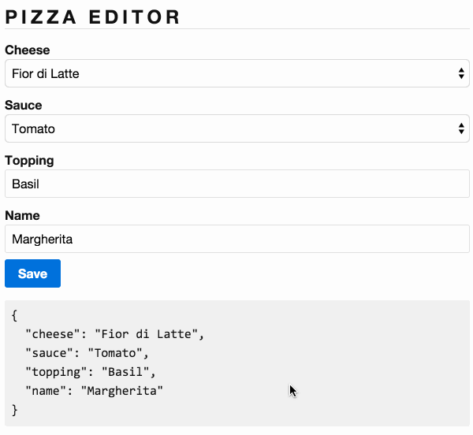

# 1.0 - Pizza Editor

For this exercise you are asked to build a pizza editor form for a very opinionated pizzeria. You are asked to complete the implementation of _*src/pizza-editor.component.ts*_ and _*src/pizza-editor.component.html*_ such that a user can modify these values. The acceptable values for the `cheese` and `sauce` are already placed in the template. Additionally the submit function has already been implemented.


# 2.0 - Validations

Now that we have a pizza editor let's add some validations to it. Complete the implementation of _*src/pizza-editor.component.ts*_ and _*src/pizza-editor.component.html*_ such that:

- `cheese`, `sauce` and `name` are required.
- All fields should get a `red` border if invalid and a `green` one if valid. Use the `@Component` decorator's `styles` property to define this.
- Display the `Name is required` alert if nothing provided. The alert box is already in the template.
- The `save` button should be disabled until the form is valid.

# 3.0 - Pizza Editor Custom Validations

In addition to the validations you built in the previous exercise the pizzeria wants to add some custom validations. Complete the implementation of _*src/custom-validators.ts*_, _*src/pizza-editor.component.ts*_ and _*src/pizza-editor.component.html*_ to add a custom validations:

**Acceptable Topping** the user can specify only one topping and valid toppings are listed below. The topping input must remain a text field and the value is case insensitive.

  ```js
  ['tomato', 'basil', 'garlic', 'eggplant', 'onion', 'salami', 'prosciutto']
  ```

Display appropriate error messages when the validation fails.

## Expected Results

When the values are modified and the user clicks on `save` the values in grey box should update to match.


