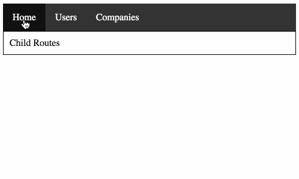
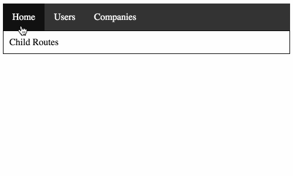
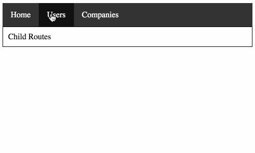

# Exercise 1 - Basic Routing

This series of exercises will walk you through configuring basic routing for an application. Most of the components have already been built out, and the areas that require completion are:

* `RouteConfig` in _*src/app/app.routes.ts*_
* Use correct `routerLink` to provide links to Home, Users List and Company List
* Setup a default route for the `Home` component 

# Exercise 2 - Basic Routing with Paramaters

* Add a route that takes an `:id` paramater to load the `UserDetails` component in _*src/app/app.routes.ts*_
* Modify `UsersList` component so the user names become links to the user detail, using the `id` on the user object.
* Modify the `UserDetail` component to use the `ActivatedRoute` service to load the correct user details

## Expected results

* When on the Users header, you should see a list of users
* When clicking a user in the list, you should navigate to a user details page
* When on the Company header, you should see a list of companies

# Exercise 3 - Child Routes

Complete, and or fix implementation of:

* _src/app/app.routes.ts_
* _src/containers/users.component.ts_
* _src/containers/companies.component.ts_
* _src/components/company-list.component.ts_
* _src/components/user-list.component.ts_

## Expected Results

* When in the Users list, clicking on a user should display the user details next to the list (insead of navigating to a new page)
* When clicking on a Company Name, the list of users for the company should be displayed
* When clicking on a user name, you should be navigated to the user list with the user details loaded of the selected user

