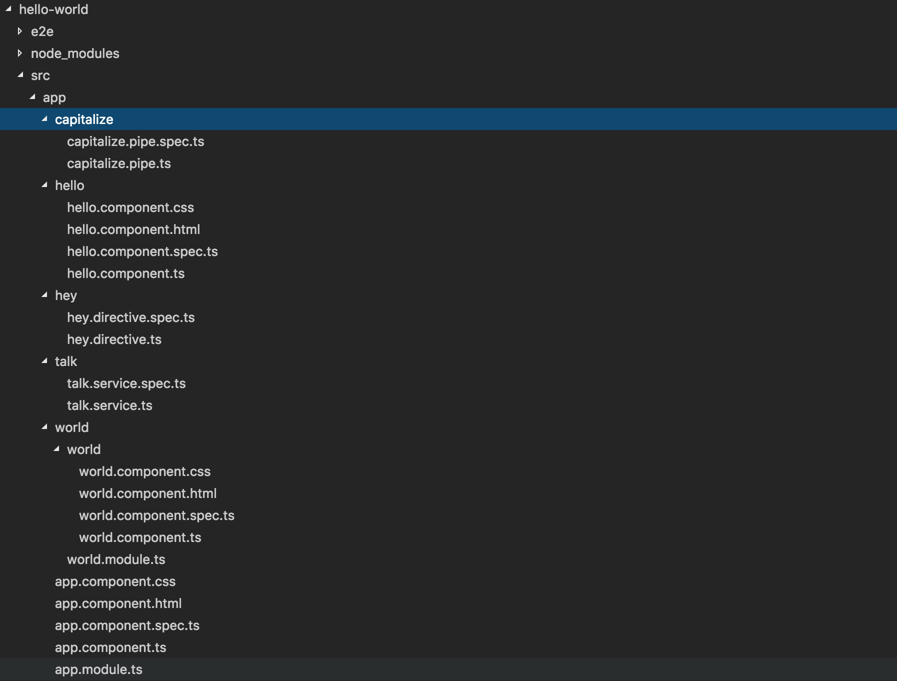

# Angular CLI Exercise

Using `angular-cli`, create a new project with:
  - A `HelloComponent` component
  - A `HeyDirective` directive
  - A `CapitalizePipe` pipe
  - A `TalkService` service
  - A `WorldModule` module
  - A `WorldComponent` inside of `WorldModule` module

## Step 1

Using the `angular-cli` create a new project called `hello-world` inside of the `training` folder.

## Step 2

Run your application. You should see `app works!` when navigating to `localhost:4200`.

## Step 3

Create a `HelloComponent` component.

## Step 4

Create a `HeyDirective` directive in a `hey` subfolder.

## Step 5

Create a `CapitalizePipe` pipe in a `capitalize` subfolder.

## Step 6

Create a `TalkService` service in a `talk` subfolder.

## Step 7

Create a `WorldModule` module.

## Step 8

Create a `WorldComponent` inside of `WorldModule` module.
