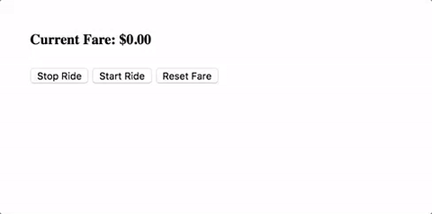

# Components in Depth Exercise



## Step 1

Using the `angular-cli` create a new project called `components-in-depth` inside 
of the `training` folder.

## Step 2

Use the `angular-cli` to `generate` a `button-grouping` and a `counter-display` 
component.

## Step 3

In `button-grouping.component.ts`, add the following `@Input` property
- counterValue

and the following `@Output` EventEmitters
- onIncrement
- onDecrement

## Step 4

Implement the `increment` method to emit the `onIncrement` event containing the 
`counterValue` incremented by 1.

Implement the `decrement` method to emit the `onDecrement` event containing the 
`counterValue` decremented by 1.

## Step 5

Create two buttons in `button-grouping.component.html` that will call our 
`increment` and `decrement` methods when pressed.

Use `ng-content` inside the buttons such that we can use projection to pass in
custom button text.

## Step 6

In `counter-display.component.ts`:
- create a `defaultCounterValue` variable with a value of 10
- create a `counterValue` variable which will keep track of the current value
- implement a `setDefaultValue` method which will update `counterValue` to the 
default value
- call the `setDefaultValue` in the `OnInit` hook to instantiate the value of 
`counterValue`

## Step 7

Place the following snippet into `counter-display.component.html`.
```html
<input type="number">
<button>
  Set default value
</button>

<h4>{{ counterValue }}</h4>
<app-button-grouping>
</app-button-grouping>
```

- Use `[(ngModel)]` to two-way bind `defaultCounterValue` to the input
- Add a `click` event handler to call the `setDefaultValue` method
- For `<app-button-grouping>`:
    - pass in the `counterValue`
    - handle the `output` events by setting the `counterValue` to the emitted 
      value
    - use projection to pass in some text to label our buttons

## Step 8

Add `<app-counter-display></app-counter-display>` to the `app.component.html` 
template.
