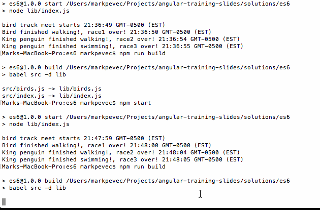

# ES6 and Babel Review Exercise

An exercise to create a little node ES6 app, compiled with Babel



## Step 1

Create a new folder called `es6` inside of the `training` folder.  Run `npm init -y` in the `es6` folder to initialize a new npm package.

## Step 2

Install the Babel CLI in the `es6` folder with the command `npm i -D babel-cli`.  Then install the `babel-preset-env` Babel preset (it will set the plugins/presets necessary for desired target) with the command `npm i -D babel-preset-env`.

## Step 3

Create a .babelrc file in `es6` and include the below in it:

```js
{
  "presets": ["env"]
}
```

## Step 4

Add the lines `"build": "babel src -d lib"` and `"start" : "node lib/index.js"` to the `scripts` property of the `package.json` object (to allow building with Babel via the `npm run build` command and starting the app with `npm start`).

## Step 5

In the `es6` folder create a `src` folder and inside it a file `index.js` and a file `birds.js`.

## Step 6

In the `birds.js` file create a class called `Bird` and another class called `Penguin`.  `Penguin` should extend `Bird`.  `Bird` should have properties for `height`.  `Penguin` should inherit that and also have a `type` property.  Create appropriate constructors for each, taking intializers for all their properties.

## Step 7

Add a method to both classes called `walk`.  For the `Bird` the `walk` method should return a Promise that resolves after `height * 500` milliseconds.  For the `Penguin` the `walk` method should return a Promise that resolves after `height * 1000` seconds. Use only arrow function syntax within `walk`.  Also for `Bird` the `walk` Promise resolve should return "Bird finished walking!" and for `Penguin` it should return `Penguin.type + " penguin finished walking!"`.  Use a template string for the `Penguin` resolve.

## Step 8

Add another method to `Penguin` called `swim` which returns a similar Promise to `walk` except that it resolves after `height * 100` milliseconds and the resolve string should be `Penguin.type + " penguin finished swimming!"`.  Use a template string.

## Step 9

Export the `Bird` and `Penguin` classes from `birds.js`

## Step 10

Import the `Bird` and `Penguin` classes in `index.js`.  Also create a immediately invoked function expression using an arrow function with no parameters.

## Step 11

Inside the IIFE, add the line `let birdDetails = [[3], [6,'Emperor'], [4,'King']];`

## Step 12

Inside the IIFE, use the `map` function with an arrow function to map `birdDetails` to an array of `Birds` and `Penguins` (single element arrays become `Bird` and two element arrays become `Penguin`)

## Step 13

Inside the IIFE, use a destructuring assignment to set the array elements to the variable `bird`, `emperorPenguin`, and `kingPenguin` in a single line

## Step 14

Console log a template string of the form `bird track meet starts + (new Date()).toTimeString()`

## Step 15

Use a Promises to have the `bird` and `emperorPenguin` have a `walk` race. When the race ends, console log a template sting to `resolve-value + ", race1 over! " + (new Date()).toTimeString()`

## Step 16

When the race above is over, do another `walk` "race" between the `kingPenguin` and the `emperorPenguin`, but this time, whoever arrives at the finish line first will wait for the other to catch up and finish *together*. Console log a template string for each bird to `value + " race2 over! " + (new Date()).toTimeString())`
