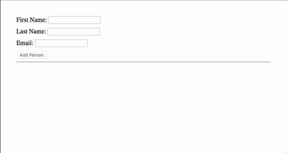

# Form Builder Exercise

Create a reactive form component using `formBuilder` with the following behavior:



## Step 1

Create a new project called `form-builder` inside of the `training` folder using
`angular-cli`.

## Step 2

Modify `app.module.ts` to import `ReactiveFormsModule` from `@angular/forms` and
add it to the imports array.

## Step 3

Modify `app.component.ts` to import `Validators`, `FormGroup`, `FormControl`, and
`FormBuilder` from `@angular/forms`.

## Step 4

Pass `builder` of type `FormBuilder` to the constructor.

## Step 5

Declare a `contacts` property initialized as an empty array in the
`AppComponent`.

## Step 6

Declare two properties: `firstName`, and `lastName` as new `FormControl`s.

## Step 7

Group the properties together you declared in step 6 using our `builder`s `group`
function and pass it to a new property called `contactForm` of type `formGroup`.

## Step 8

Create a method named `addContact` that takes the values from `contactForm` and
pushes the object into the contacts array then clears the form.

## Step 9

Modify the `app.component.html` template file to contain the markup content for
the form with a container `<form>` element and specify that it's a `formGroup` named
`contactForm` like so,  `<form [formGroup]="contactForm">`. Also, bind the
`addContact()` method to the form's `ngSubmit` event. 

## Step 10

Add `label`s and `input` elements to the form for each formControl we declared in
step 6. Also, Add a submit button to the bottom of the form. Similar to the form
element we need to specify that each `<input>` is connected to a `FormControl`
from our component. For example, the `firstName` input should have
`[formControl]="firstName"`.

## Step 11

Below the form element, add a `<ul>` element to display our contacts then add a `<li>` element with an
`ngFor` directive to loop through all contacts in the `contacts` array we made in step
5\. Each `<li>` element should display the first name and last name of a
contact. You can use the below html as a starting point.

```html
<form>
  <div class="row">
    <label for="firstName">First Name:</label>
    <input type="text" name="firstName" id="firstName" />
    <ul class="errors">
      <li class="error">
        ...
      </li>
    </ul>
  </div>

  <div class="row">
    <label for="lastName">Last Name:</label>
    <input type="text" name="lastName" id="lastName"/>
    <ul class="errors">
      <li class="error" >
        ...
      </li>
    </ul>
  </div>

  <button type="submit">Add Person</button>
</form>
<hr>
<ul>
  <li>
    ...
  </li>
</ul>

```


## Step 12

In `app.component.ts`, add `required` and `minlength(2)` validators to the
`firstName` and `lastName` `FormControl`s.

## Step 13

For each of the `input` elements add an element to display an error list `<ul>`
underneath that is hidden using the `[hidden]` attribute if the control above is
`valid` or `untouched`.

## Step 14

Add an error list item `<li>` in the error list for each control for each possible error. This error should be hidden (via a the hidden attribute) unless the given control has the error present.

## Step 15

Set the submit button to be disabled unless the form is valid.

## Step 16

Let's add some styling to our application by adding the following css to the
`app.component.css` file.
- Wrap each `FormControl` in the template (including
the `label`, `input`, and `<ul>` error list) in a div with the `.row` class.
- Add the `.error` class to each `<ul>` error list element.
- Add the `.contact-item` class to the `<li>` element using the `*ngFor` directive
in the contact list.

```css
:host {
  display: block;
  padding: 2rem;
}

ul {
  padding: 10px;
}

li.contact-item {
  list-style: none;
  padding: 10px 15px;
  background: #0288d1;
  color: #FFFFFF;
  font-size: 1em;
  font-weight: 600;
  margin-bottom: 10px;
}

div.row {
  margin-bottom: 10px;
}

input.ng-invalid.ng-touched {
  border: 1px solid red;
}

.errors {
  color: red;  
}

```
