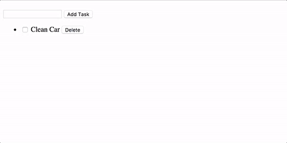

# ng-rx/store Exercise

Using the data provided in the file `data.json` create a to-do application as shown below:

## Step 1

Using the `angular-cli` create a new project called `ng-rx` inside of the `training` folder.

## Step 2

Copy the file `db.json` into the root folder and use `json-server` to start a fake REST api server. This file should serve as your initial to-do list of items loaded from the server. 

## Step 3

Inside the `app` folder create a sub folder called `store`. In that folder create your `action`, `effects`, `model` and `reducer`. 

## Step 4

Create a `dumb` child component called `<todo-input>` with a single button to perform the following action:

- **Add Task** Add the new todo item. 

*(hint: Make sure that the `insert` event is emitted to the parent and handeled/dispatched from there.)*

## Step 5

Create another `dumb` child component called `<todo-list>` to delegate the rendering of every individual `todo` item in the array.

*(hint: Pass the list of `todo` items from the parent into this child component. You should also listen to the store from the same parent component.)*

## Step 6 

For each item in the `<todo-list>` add a checkbox to toggle the `complete` property of the `todo` item. 

## Step 7

For each item in the `<todo-list>` add the following button.

- **Delete**  Delete the todo item. 

*(hint: Make sure that the `delete` event is emitted to the parent and handeled/dispatched from there.)*