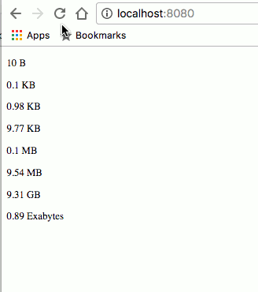

# File Size Pipe

Formats a filesize for readability. The input is passed in bytes (B).
The set of input file sizes is 10, 100, 1000, 10000, 100000, 10000000, 10000000000, 10^15
The result should like as shown in gif below

Quick reference:

- 1024^0 Bytes = 1 Byte (B)
- 1024^1 Bytes = 1 Kilobyte (KB)
- 1024^2 Bytes = 1 Megabyte (MB)
- 1024^3 Bytes = 1 Gigabyte (GB)
- 1024^4 Bytes = 1 Terabyte (TB)
- 1024^5 Bytes = 1 Perabyte (PB)
...

File size is: {{ 1024^4 | fileSize }}
=
File size is: 1.00 TB

Next, try adding an aditional boolean parameter where, if true, writes the unit in long form

File size is: {{ 1024^4 | fileSize }}
=
File size is: 1.00 Terabytes

## Step 1

Using the `angular-cli` create a new project called `pipes` inside of the `training` folder.

## Step 2

Modify the `app.component.ts` file with an array property `fileSizes = [10, 100, 1000, 10000, 100000, 10000000, 10000000000];` and another property `largeFileSize = Math.pow(10, 15)`.

## Step 3

Modify the `app.component.html` file to create a template that uses `NgFor` (`*ngFor`) to display the `fileSizes` array in a column of `
` elements and the `largeFileSize` in another `
` below.

## Step 4

