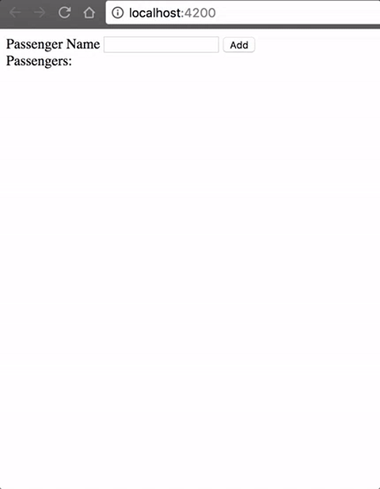

# 1.0 - Passengers in a train

For this exercise you are asked to build a list that you can add and remove elements from. This list should be in the store.

We need to know what are the passengers we have in a train, as well as add and remove passengers from it.

# 2.0 - Configure Redux

* Add Redux and ng2-redux dependencies into the project
* Create train and root reducers
* Configure redux in app-module

# 3.0 - Actions

* Create addPassenger action
* Create removePassenger action
* Update train reducer to work with the new actions

# 4.0 - Hook everything in your component

* Dispatch addPassenger action when user clicks on the 'add' button
* select passengers list from the state and display it using ngFor
* Get index value and dispatch action when user clicks on 'remove' button

# 5.0 - Refining your solution

* Creating an interface to describe your state
* Avoid mutations on your reducer

