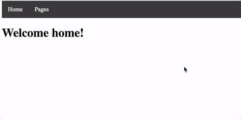

# Routing Exercise

Using the data provided in the file `users.json`, create an application with routing as shown below:



## Step 1

Using the `angular-cli` create a new project in the training folder called `routing-exercise` with the `--routing` flag:

```
ng new routing-exercise --routing
```


## Step 2

Use the `angular-cli` to build the components and service we need by running the following commands:

```
ng generate component home
ng generate component user-list
ng generate component user-detail
```

> The components are added to our ng-module automatically, so they are ready to use.

## Step 3

Add the following snippet to `app.component.css`:

```css
ul {
  list-style-type: none;
  margin: 0;
  padding: 0;
  overflow: hidden;
  background-color: #333;
}

li  {
 float: left;
}

li a {
  display: block;
  color: white;
  text-align: center;
  padding: 14px 16px;
  text-decoration: none;
}

li a:hover {
  background-color: #111;
}
```

## Step 4

Add the following snippet to the `app.component.html`

```html
<ul>
   <li>
      <a>Dashboard</a>
    </li>
    <li>
      <a>Users</a>
    </li>
</ul>
```


## Step 5

Modify the anchor tags we just added to `app.component.html` by using the `routerLink` directive so that they point to the root path `"/"` and the users path `"/users"`. Then add the `router-outlet` directive so that angular knows where to display the components.


## Step 6

Import the `HomeComponent` and `UserListComponent` in `app-routing.module.ts`. Update the routes so that the root path `"/"` loads the `HomeComponent` and the `"/users"` path loads the `UserListComponent`.

## Step 7

In `user-list.component.ts`, retrieve the user data in `users.json` by using the `require` keyword.
Normally this data should be served from a service, but we are doing this for simplicity sake.
```
const data = require('../users.json');
```
On the `OnInit` hook, store the user data in the `users` property.

> Make sure the path to the provided `users.json` file is correct. We must use the `require` syntax because JSON is not a valid Javascript module but Webpack can transform it into a Javascript object.

## Step 8

Replace `user-list.component.html` with the following snippet:

```html
<h1>Users</h1>

<ul>
  <li *ngFor="let user of users">
    <a>
      {{user.name}}
    </a>
    </li>
</ul>
```

## Step 9

Modify the `user-list.component.html` using the routerLink directive so that each link points to a specific user id.

## Step 10

Add the following snippet to the `user-detail.component.html` file:

```html
<h2>{{user?.name}}</h2>
<label>Company: </label> {{user?.company}} <br>
<label>Email: </label> {{user?.email}}
```

## Step 11

In `UserDetailComponent`:

Retrieve the data from the `users.json` file
```
const data = require('../users.json');
```

Also add the following method:
```
getUser(id: string) {
  return data.users.filter(user => user.id === id).reduce(user => user);
}
```

## Step 12

Create another route in `app-routing.module.ts` for the `UserDetailComponent` that takes an extra `:id` parameter.

## Step 13

Import and inject the `ActivatedRoute` into the `UserDetailComponent`.

## Step 14

Finally, update the `UserDetailComponent` to subscribe to the `ActivatedRoute`, then use the `id` parameter from the route to load the user data using the `getUser` method.

