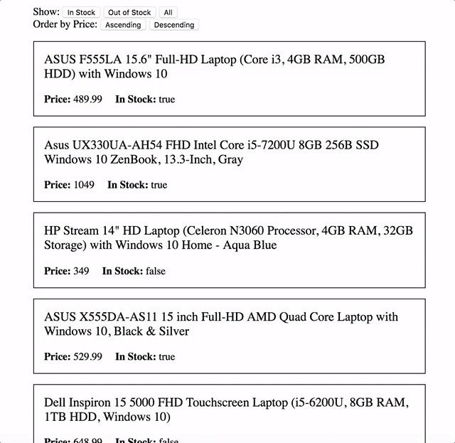

# Structural Directives Exercise

Using the data provided in the file `data.json` create a filtered list application as shown below



## Step 1

Using the `angular-cli` create a new project called `structural-directives` inside of the `training` folder.

## Step 2

Create a new folder inside of `src/app` named `shared` and copy the file `data.json` into it. Import its content into the root component of your application. Make sure your able to read its content using `console.log`.

> To import a JSON file you have to use `require` instead of `import` because it's not a valid Javascript module (ES6) but a file that Webpack can load and transform into a Javascript object.

## Step 3

Create a Typescript `interface` called `Laptop` in the `shared` folder that describes the structure of the items found in the file `data.json`


## Step 4

Create a component called `<app-laptop>` to display information about a laptop and use the following markup and CSS to give it some style:

```html
<p class="title"><!-- Laptop description goes here --></p>
<span class="price">
  <label>Price:</label>
  <!-- Laptop price goes here -->
</span>
<span class="in-stock">
  <label>In Stock:</label>
  <!-- Laptop stock goes here -->
</span>
```

```css
:host {
  display: block;
  border: 1px solid black;
  margin: 1rem 0;
  padding: 1rem;
}

.title {
  margin-top: 0;
  font-size: 1.2rem;
}

label {
  font-weight: bold;
}

.price, .in-stock {
  display: inline-block;
}

.in-stock {
  margin-left: 1rem;
}
```

## Step 5

Create a `<app-filter>` component with five buttons split into two groups (wrap each group in a `div` tag) that perform the following filtering:

**Stock:**
- **In Stock:** Show all the laptops that are in stock
- **Out Stock:** Show only the laptops that are out of stock
- **All:** Show all the laptops

**Price:**
- **Ascending:** Put the cheapest laptops at the top
- **Descending:** Put the cheapest laptops at the bottom

## Step 6

Create an input for the `<app-filter>` component named `laptop` to store an array of `Laptop`s. Also, create an output named `filter` as a new `EventEmitter` that emits an array of `Laptop`s.

## Step 7

For each button created in step 5, create a method that creates a new array of laptops by filtering or sorting through the objects stored in the `laptop` property and emits that new array using the `filter` output. Call each method when a click event is fired from the corresponding button.

## Step 8

Create a component called `<app-laptop-list>` that has two properties named `laptops` and `filteredLaptops` that both store an array of `Laptop`s. Also, create a method that takes the array emitted by the `<app-filter>` and stores it in the `filteredLaptops` property.

## Step 9

In the `<app-laptop-list>` template, Include the `<app-filter>`
and use the `ngFor` directive to loop through all laptops in the `filteredLaptops` property and display them in `<app-laptop>` components.

## Step 10

Use the template of the root component to display the `<app-laptop-list>` component.

```html
<app-laptop-list></app-laptop-list>
```
