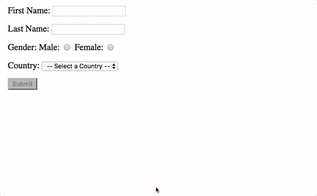

# Template Driven Form with Validation

Create a template driven form with the following behavior



## Step 1

Using the `angular-cli` create a new project called `template-driven-forms` inside of the `training` folder.

## Step 2

Create a Typescript `interface` called `Person` that captures the data model of the form in a file called `person.model.ts`

## Step 3

Modify the `app.component.ts` to import the `Person` created in Step 2 and declare a property of that type on your `AppComponent`.

## Step 4

Declare properties (of the appropriate types, or appropriately initialized) in `AppComponent` to store the possible options of the radio and select controls of the form as well as a property `isVisible` to store if the display data is available or not.

## Step 5

Modify the `app.component.html` template file to contain the HTML content of the form (with a container `form` element, with `NgForm` directive, and template variable allowing the `form` to be referenced in the HTML) and continaing `label`s, appropriate `input` and `select` elements, and a `submit` `button`, also add the `NgModel` directive to the `input` and `select` elements)

## Step 6

Modify the `input` elements to add template variables to each so that they can be referenced in the HTML.  Also add the `required` attribute to all of them.

## Step 7

For the country `select` element put an `option` (set with `selected` and `disabled` attributes) for the '--Select a Country--' title option.  Use the `NgFor` directive to add the set options for the possible countries based on the appropriate initialized property that was added to `AppComponent`.  Optionally also use `NgFor` with the `ng-container` element to define the radio options for the gender `input` element.

## Step 8

For each of the `input`, or `select` elements add an element to display an error list `ul` underneath that is hidden (via a class called `hidden` with `display: none;` or the `hidden` attribute) if the control above is `valid` or `untouched`

## Step 9

Add an error list item `li` in the error list for each control for the only possible error ('The X is required').  This error should be hidden (via a class called `hidden` with `display: none;` or the `hidden` attribute) unless the given control has the `required` error present

## Step 10

Set the submit button to be `disabled` unless the form is valid.  Also add a method to `AppComponent` called `getForm()` that takes an `NgForm` and set the form to call the `getForm()` method passing itself when the submit event occurs.  Implement the `getForm()` method to set the `Person` property of `AppComponent` to the value from the `NgForm` and to set the `isVisible` property to `true`

## Step 11

Add a `p` element (after the `form`) to display the `Person` property from the `AppComponent` based on the `isVisible` property using the `NgIf` directive.  Display formatted appropriately by passing the `Person` property through a `json` pipe.

## Step 12

Add a `button` (after the `form` and `p`) to toggle displaying the `p` element (and itself using `NgIf`).  It should be visible based on the `isVisible` property and clicking it should set `isVisible` to `false`

## Step 13

Add some styling to your form by placing the following css in the `app.component.css` and wrapping the rows (including `label`, control, and error list) in a `<div class="row"></div>` and placing the class `error` on the error list items.

```css
:host {
  display: block;
  padding: 2rem;
}
.error {
  color: red
}
.hidden {
  display: none;
}
input.ng-invalid.ng-touched {
  border: 1px solid red;
}
.row {
  margin: 0.8rem 0;
}
```