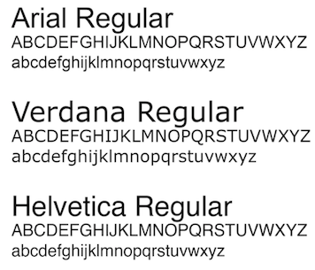
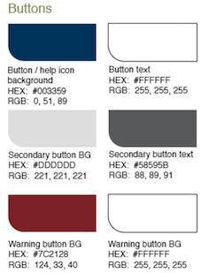
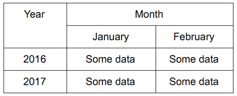
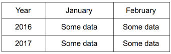

<!-- .slide: data-background="../content/images/title-slide.jpg" -->
<!-- .slide: id="a11y" -->
## Accessibility and Angular

---
<!-- .slide: id="a11y" -->
## What is Accessibility

- Accessibility is generally defined as giving people of all abilities opportunities to participate fully in everyday life.  This more recently includes use of digital technology.

- Accessibility can often be thought of as being complimentary to, or a subset of usability.  A feature on a site may be highly usable but inaccessible.  

  - For example, a button may be easy to find and click, but inaccessible via a keyboard

- Accessibilty is now law in many parts of the world including within Canada and the U.S.

---
<!-- .slide: id="a11y" -->
## P.O.U.R.

The key principles of accessibility specify that sites must be:

1. Perceivable - Content on a site must be perceivable with assistive devices to aid those who have difficulties using one or multiple senses
1. Operable - A site must provide several ways to operate it to be accessible.  Eg. use of a mouse AND a keyboard to navigate and operate all site controls
1. Understandable - A site must use simple terms to explain concepts and complex issues / content  
  - It must function in a way that your users understand, by avoiding unusual, unexpected or inconsistent functions
1. Robust - A site must meet several accessiblity standards and guidelines on any number of 3rd party user software and tools (i.e multiple browsers, operating systems, mobile devices)

---
<!-- .slide: id="a11y" -->
## Implementing Accessibility - Starting with Design

Accessibility starts with design and includes accessibility testing throughout the product development life cycle.

Some of the Largest Identified Accessibility Barriers across Public Sites

1. Content and functionality that cannot be operated through a keyboard
1. Form fields that are not labelled properly
1. Images that don’t have alternative text
1. Insufficient contrast between text and background
1. Reading order that is not in a meaningful sequence

Designers can include several accessibility and design features to overcome challenges, as described by the following slides:

---
<!-- .slide: id="a11y" -->
## Accessible Design - Font and Colour

- Fonts: Use sans serif fonts and set a base pixel measure at 1em = 16px (=12pt)
- Colour:  Ensure foreground:background ratios are 4:5:1 for normal text and 3:1 for large text
- Images: Images must be alt tagged or have figures/numbers describing the image
<br><br> 
<br>Two images showing samples of a accessible font types and fore/back ground colour ratios
<br>

---
<!-- .slide: id="a11y" -->
## Accessible Design - Tables
- Tables:  Do not use tables for layout, only data, and explicitly label columns and rows
<br><br> 
<br>Example of an inaccessible table, cells span multiple rows and columns
<br>
<br><br>
<br>Example of an accessible table, all rows/columns explicitly labelled
<br>

---
<!-- .slide: id="a11y" -->
## Accessible Design - Links and Buttons
- Links and Buttons: Must be descriptive (e.g. 'complete order' instead of 'click here'), must indicate the action of the link or button ('this will open in a new window')

---
<!-- .slide: id="a11y" -->
## Accessible Design - Modals and Pop-Up Windows
- Modals should be developed for information purposes and not have complex interactive elements.  Modals should limit content if possible for simplicity 
- Pages with lengthy content should have clear markers indicating the scope of the content and provide the ability to jump to key points including the beginning and end


---
<!-- .slide: id="a11y" -->
## Accessible Design - Templates

- Using the above items, it is recommended a standard template for your web projects be developed
- Demo:  Accessible forms-template in angular 2 

---
<!-- .slide: id="a11y" -->
## Accessible Development

To acheive accessibility set out in design, developers can follow these tips, do's and don'ts.

General Considerations
- Attempt to pin down client requirements for browsers to be supported


Developing HTML

- Use the Title attribute on HTML anchor links to add more information about a link and/or its consequences
  - `<a href=
- Use the non-standard 'datatable=0' attribute on the Table tags to tell JAWS to ignore layout tables
- Don't use the 'summary' attribute on the Table tag if you must create a layout table (or set the 'summary' attribute to null
- Don't use TH or Caption tags on layout tables
- DO use `<TH>` and summary attributes for data tables and include the `scope="ROW"` or `scope="COL"` attributes to indicate what the `TH` is for
- Use relative width and font sizing over absolutes (this may be obvious but...)
- Use headers in sequnce (H1 - H6)
- Ensure content is read top to bottom left to right
INSERT TAB ORDER EXAMPLE


---
<!-- .slide: id="a11y" -->
## Accessible Development - Offscreen Text

- To help navigation for visually impaired users, develop offscreen-text CSS class to further mark up headers and indicate start and end of sections

```css
	.offscreen-text {
     	left: -3000px;
     	position: absolute;
     	width: 500px;
     	font-size: 100%;}
```
- Mark up text with this class beside sections, including those ARIA tagged with `<aside>`, `<main>`, `<nav>`, `<footer>`, `<header>` to indicate where the user is
- Examples:
  - 'start of navigation'
  - 'end of navigation'


---
<!-- .slide: id="a11y" -->
## Testing Accessibility 

- Accessibility testing should typically start with manual testing then automated
  - Develop appropriate scripts
  - Automate using any number of tools

- Testing against a checklist of items as compared to WCAG 2.0 AA standards can ensure compliance
- Test for usability and functionality simultaneously and don't compromise these for accessibility


---
<!-- .slide: id="a11y" -->
## Unit Testing for Accessiblity

- Code can be ‘unit tested’ for accessibility (along with functional unit testing) before it is checked into the repository. 
  - Can be as simple as running a browser add-on or plug-in such as the Firefox Accessibility plug-in
  - Helps ensure a certain level of conformance to the selected accessibility standard. 
  - Consistent with Agile development practices. 
- Will not eliminate all potential accessibility defects:
  - But will likely minimize the number of retroactive bug fixes that are required for defects not discovered until the testing phase.


